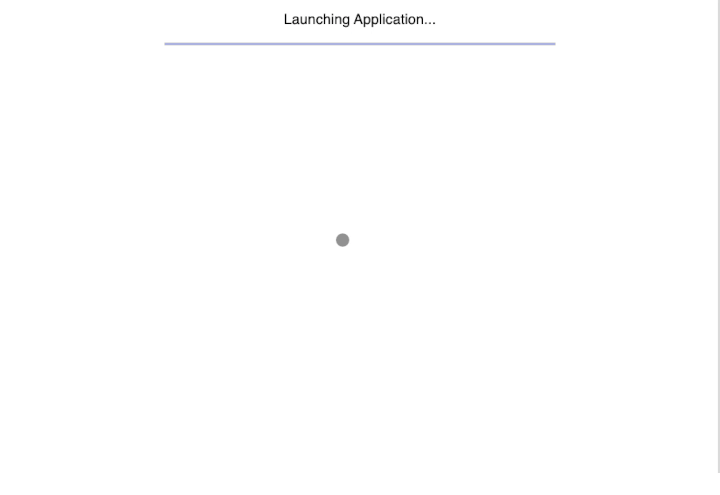

# Frontend Coding Challenge

Here is a quick coding challenge. It's important to note that it's by no means a pixel-perfect test with a single correct answer, we just want to get a sense for how you write code and approach solving problems.

You'll be building a simple react app: with a session provider. An example of the user journey looks like this:

  

## User Journey

Given a user is unauthorised when visiting a private page in the application they should be redirected to the login page. After entering their credentials the session is stored so the user can now access private pages.

The user can choose to sign out of the application, invalidating their session and removing their access to private pages.

## Instructions

- Clone this repository and set up the frontend environment using your prefered libraries and tools, don't focus too much on infrastructure - choose whatever gets you going quickly.
- We use Typescript ourselves, but please choose whatever you are most comfortable with to approach the challenge, we only ask for you to use React.
- We've provided a simple mock API you can use, feel free to make changes or create your own - calls to the API should have a 1-second delay when simulating it.
- Think about what patterns to use for managing the session state, whether it's context, hooks, a library, or a combination thereof.
- Build your components under the premise that they will end up in a larger, scalable application.
- We'd like it to look like a dashboard - you may use a component library to speed up the process.

## API

| Method        | Description                                                                     | Request Parameters                        |
| :------------ | :------------------------------------------------------------------------------ | ----------------------------------------- |
| createSession | Resolves with success object and adds a session cookie if credentials are valid | `{ username: string; password: string; }` |
| getProfile    | Resolves with fake user profile data if session is valid                        |                                           |
| signout       | Invalidates the session and resets the session cookie                           |                                           |

## Do I Need to Write Tests?

As mentioned we just want to get a sense of how you write code and solve problems, so treat this as any other piece of production code you deliver using the test toolchain of your choice.

## Submitting Your Challenge

- The challenge has to be shared as a git repository.
- You can either create a public repository on your favourite git hosting provider (GitHub, GitLab, BitBucket) and share the link.
- Or send the whole repository, zipped (including the .git directory!).
  Please include both build and run instructions, we use a mix of Windows and Mac on our end.
- Important note, please only submit your challenge when you feel you are completely done!
